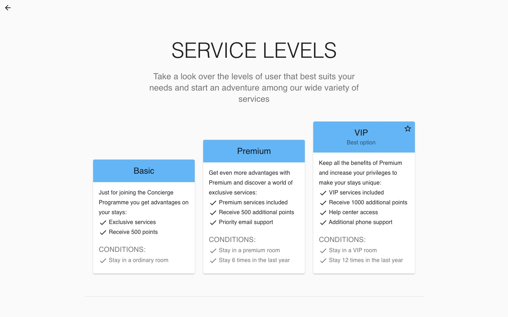
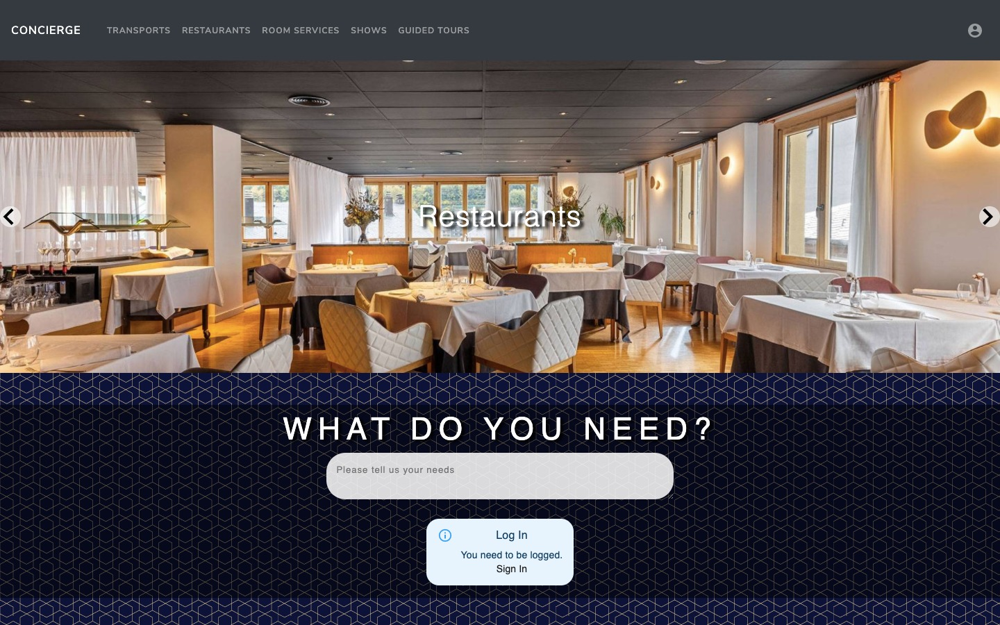
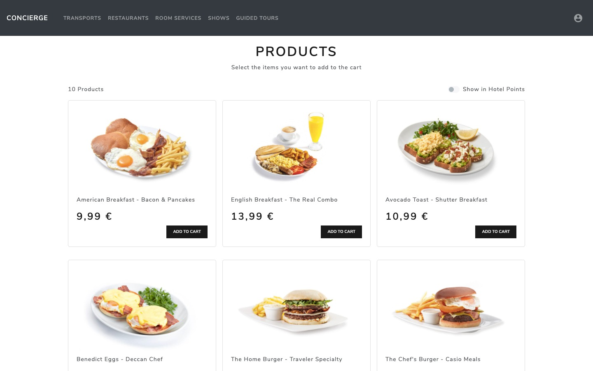
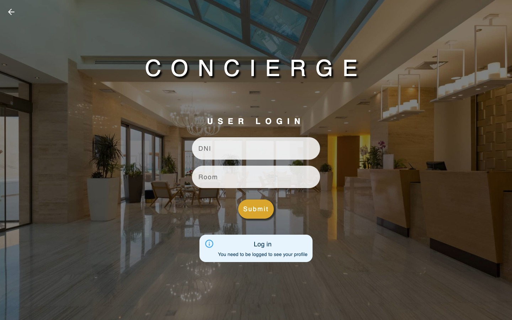
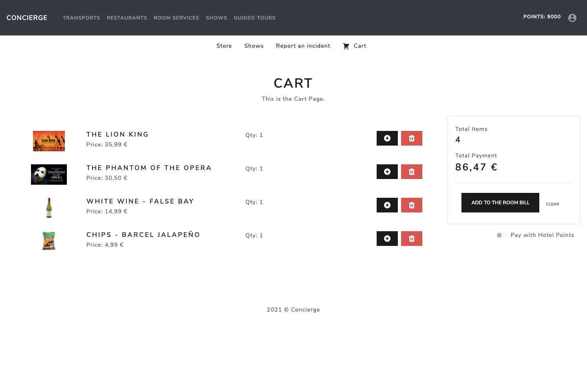

# Concierge
Repositorio para el trabajo de Concierge. 
Grupo 1 
Año: 2020-2021

### Servicio
Se ha creado un servicio de Concierge para hoteles donde los clientes podrán solicitar y acceder a diferentes servicios según su estatus dependiendo del tipo de cliente que sean. Hay ***3 niveles*** diferentes como se aprecia en la siguiente imagen.

### Frontend

La parte frontend de la aplicación se ha creado con ***React*** para poder desplegar la página web en una aplicación móvil usando ***React Native***.

### Backend

El servicio dispone de un backend creado usando una base de datos y un servidor con ***hibernate, Java y  Apache TomCat***. Así la parte cliente se comunicará con peticiones REST con el servidor. 

### Algunas fotos del servicio

### Autores:

Alejandro Aguilera Alcalde,
Enrique González Macías,
Javier Martínez Arroyo,
Pablo Barba Sabín y
Roberto Martín Luengo.

